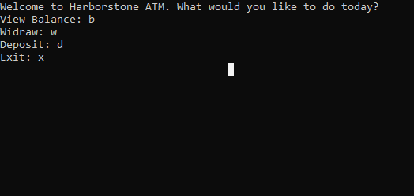

# Interactive ATM
## Language: C#

### Welcome!
This program is designed to replicate the functions of an ATM, with an option to deposit funds, withdraw funds, view your balance and exit the program.

### Visual Interface

### Directions:
You may use upper or lower case for your selections.

- View Balance - Press the `b` key to view your current balance.

- Withdraw - Press the `w` key and enter in the amount that you would like to withdraw from your account. Please note that you may cannot have a negative balance.

- Deposit - Press the `d` key and enter in the amount that you would like to deposit into your account.

- Exit - Simply press the `x` key to exit!